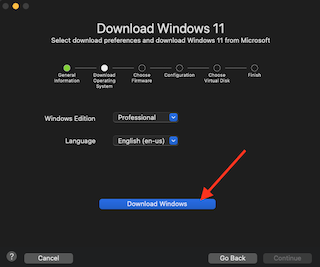

# Installing Power BI on M1/M2 Macbook with VMware Fusion

### M1/M2 chips 

- The Apple M1 and M2 chips, used in MacBooks and other Apple devices, are based on the ARM architecture. They are not x86 chips. Both the M1 and M2 chips are 64-bit processors.

### Virtual machine

- **VMware Fusion** is a mac version of vmware that supports ARM architecture.

- **Do not use Virtual box** as it does not support the ARM architecture (works on intel chips).

### Windows

- VMware Fusion does not mimic or “emulate” a different CPU for virtual machines. Hence our Windows OS must use the same ARM architecture.

- Windows 10 ARM does exist but its not well supported (any win 10 32/64 bit iso will not work with VMware Fusion). 

- Use Windows 11 from the "Get Windows feature" within VMware Fusion.

- Note you can skip product key in windows setup to use indefinitely.

### Power BI

- Use the x86 32 bit version of Power BI. The 64bit version will fail to install on Windows 11 ARM.

## Steps:

1) Install [VMware Fusion](https://www.vmware.com/au/products/fusion.html) free trial.
2) Create a VM:
    - Using the "Get Windows from Microsoft" option.

    

    - Select Windows Professional and start download.

     
     

    - When download is complete enter through the next screens leaving the default settings and provide a password.

    
    

    - You will need to create a virtual disk. Note this is the maximum space the VM can take up but the actual consumption will vary based on the VM's data due to thin provisioning.

    
    

    - Finish and name your VM.

    

3) Start the VM and setup Windows:
    - The VM should have the iso downloaded earlier mounted on the CD/DVD drive and should prompt "press any key" to boot from CD/DVD .
    
    

    - If you miss the key prompt either restart the VM and try again or wait, the boot manager will appear and you can select "SATA CDROM DRIVE".
    
    

    - Go through and complete the Windows 11 setup.

    

    - **Note** sometimes the network adapters are not working correctly (found on macbook air). Windows setup page requires us to connect to the network. We can bypass this requirment by entering into the command prompt with fn + shift + f10 key. Then typing the command "OOBE\BYPASSNRO"

    
    

4) Install VMware tools:
    - In the dropdown menu under "Virtual machine" select "install VMware tools". This will allow you to copy and paste as well as drag and drop files from mac to vm (you will need to restart afterwards).

    

    - Make sure network adapter is connected (click connect and make sure in the settings it is green)

    - **Note** I noticed it took a while for the copy paste / drag and drop to work. Try to and from mac you may need to restart again and fiddle with it a bit.

5) Install Power BI:
    - Download the x86 32 bit version of [Power BI](https://powerbi.microsoft.com/en-us/downloads/) from [here](https://www.microsoft.com/en-us/download/details.aspx?id=58494).The 64 bit version will fail on install, dont use it.

    

    - Drag and drop from Mac to VM and install.

    
    
    - Run Power BI.

    

## Working as of:
Date: 2023-11-12
- MacBook Pro 14-inch, 2023 Apple M2, Ventura 13.5.1
- MacBook Air 13-inch, 2020 Apple M1, Big Sur 11.7